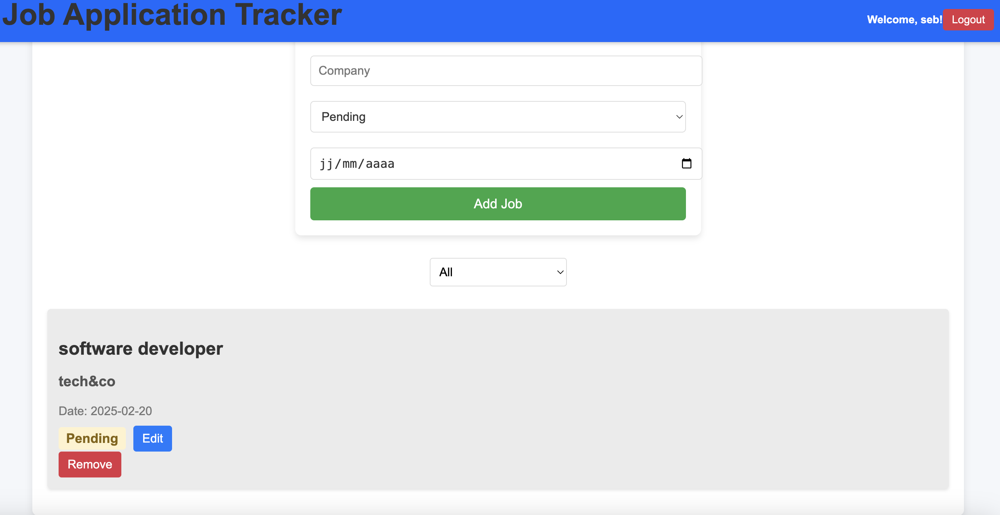

# Job Tracker Application

I built a simple full stack job tracker app using the MERN stack. This application can be used to manage your job application process by allowing users to add, update, or delete job applications. You can access a live demo provided by a Vercel/Render deployment.

## Features

- **User Authentication**: Secure user sign-up and login using JWT
- **Job Management**: Add, update, and delete jobs with details like title, company, and status.
- **Job Filtering**: Filter jobs by their application status
- **Persistent storage**: User applications are stored in a MongoDB cloud database

## Technologies Used

- **Frontend**: React.js
- **Backend**: Node.js with Express.js
- **Database**: MongoDB
- **Authentication**: JWT

## Deployment

The frontend is deployed on **Vercel** and the backend is deployed on **Render**.

## Live Demo

You can try the app here: [[Vercel-Live demo](https://job-tracker-switt.vercel.app/)] 
